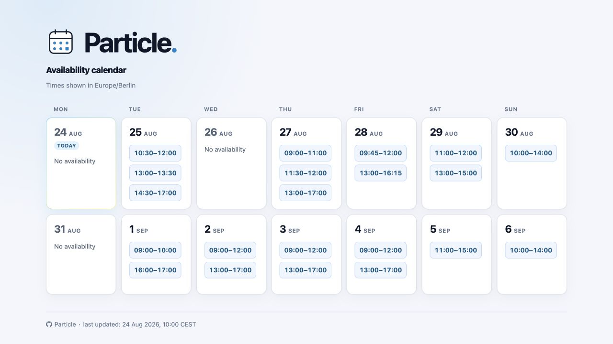

<h1>
  
  Particle.
</h1>

Particle, from Party Cal, is a Ruby command-line static-site generator. It downloads one or more private iCalendar subscriptions, treats every valid event in every feed as busy, merges the busy periods, subtracts them from configured availability hours, and writes a mobile-friendly calendar view containing only free time.

There is no application server, database, browser API, booking flow, or Ruby process at request time. Nginx serves the files in `public/` directly.

```text
private ICS feeds → Ruby generator → public/index.html → Nginx → HTTPS
```

See the [live sample calendar](https://mendab1e.github.io/particle/sample/) for a generated page showing split availability, busy days, unavailable weekdays, and different weekend hours. It uses only synthetic calendar data. The [HTML source](docs/sample/index.html) is also available in the repository.



## Privacy and failure model

Calendar URLs are used only by the generator. The generated HTML contains dates, calculated free intervals, and an update timestamp. It never renders titles, descriptions, locations, attendees, UIDs, calendar names, source URLs, or raw ICS. Logs refer to feeds only as `Calendar 1`, `Calendar 2`, and so on.

All configured feeds must download and be parseable as calendars. If any feed fails, generation exits non-zero before publishing. Individual malformed events are ignored, and logs report only a count such as `Calendar 1 ignored 2 malformed events`. No event values are logged. Skipping an event can display false free time if that event was intended to be busy. Output is prepared in temporary files on the same filesystem and `index.html` is atomically renamed only after the complete calculation and render succeed, preserving the previously known-good page.

The page includes `noindex, nofollow, noarchive, nosnippet, noimageindex` plus a no-referrer policy, and `public/robots.txt` disallows all crawling. The Nginx example reinforces those directives with response headers, disables shared/browser caching, and serves the robots policy from the required origin-wide `/robots.txt` location. These are requests to well-behaved crawlers, **not authentication or access control**. A long random path reduces accidental discovery but does not prevent a recipient from sharing the URL. Enable HTTP authentication in Nginx if non-discoverability must be enforced against arbitrary scrapers.

## Requirements and installation

- Ruby 3.4 or newer
- A normal Linux VPS for production

Install the gem to add the `particle` command:

```bash
gem install particle-calendar
particle --help
```

The core libraries are:

- [`icalendar`](https://github.com/icalendar/icalendar) to parse RFC 5545 data;
- [`icalendar-recurrence`](https://github.com/icalendar/icalendar-recurrence), backed by `ice_cube`, to expand only occurrences intersecting the output range;
- `ActiveSupport::TimeWithZone` and `tzinfo` to retain named time zones and wall-clock recurrence times across DST;
- standard-library `Net::HTTP`, ERB, YAML, and filesystem primitives;
- RSpec and WebMock for tests.

`icalendar` parses recurrence properties but does not itself produce occurrence instances. `icalendar-recurrence` supplies date-bounded `occurrences_between` expansion, including common `RRULE`, `RDATE`, and `EXDATE` behavior. Particle additionally chunks dense secondly/minutely rules and applies event/calendar occurrence-count limits before retaining expanded results. The generator also handles exact detached `RECURRENCE-ID` overrides and cancellations so a moved instance replaces its original occurrence.

## Configuration

Create a starter configuration, an Nginx server-block sample, and the static output directory:

```bash
particle setup
```

By default this writes `particle.yml` with mode `0600`, `particle.nginx.conf`, `public/`, and `log/` in the current directory. It generates a long random URL path for the Nginx sample and refuses to replace either setup file if it already exists.

Customize every destination when needed:

```bash
particle setup \
  --config /opt/particle/availability.yml \
  --output /var/www/particle \
  --nginx /opt/particle/particle.nginx.conf \
  --server-name calendar.example.com \
  --url-path /replace-with-a-long-random-value/
```

Run `particle setup --help` for all options. Generation defaults to `particle.yml` and `public/` in the current directory. Select other locations with `--config` and `--output`, or with `PARTICLE_CONFIG` and `PARTICLE_OUTPUT`. `AVAILABILITY_CONFIG` remains accepted for compatibility.

```yaml
enabled: true
timezone: Europe/Berlin

calendar_urls:
  - "${CALENDAR_MAIN_URL}"
  - "${CALENDAR_EXTRA_URL}"

days_to_show: 28
minimum_slot_minutes: 60

event_buffer:
  before_minutes: 30
  after_minutes: 30

availability:
  default:
    - start: "09:00"
      end: "13:00"
    - start: "14:00"
      end: "00:00"

  sunday:
    - start: "10:00"
      end: "18:00"

  monday:
    unavailable: true
```

### Calendar feeds and secrets

`calendar_urls` accepts HTTPS, HTTP, or `webcal://` subscription URLs. Webcal URLs are downloaded over HTTPS. Every feed contributes busy time with OR semantics: if any calendar is busy, the shared view is busy. Overlapping and adjacent periods are merged before subtraction.

Configuration keys are strict: unknown top-level, `event_buffer`, weekday, and window keys fail generation instead of silently applying defaults. At most 20 calendars and 366 displayed days are accepted. Calendar feeds are also limited to 10,000 events, 10,000 expanded occurrences per event, and 50,000 expanded occurrences per calendar. Exceeding a feed limit fails the run and preserves the known-good page.

A URL may be literal, or an exact `${UPPERCASE_ENV_NAME}` placeholder. No ERB is evaluated, so the YAML file cannot execute Ruby code.

For simple VPS use, put literal URLs only in the deployment configuration and keep it protected (`particle setup` applies this mode automatically):

```bash
chmod 600 /opt/particle/particle.yml
```

For environment-based configuration:

```bash
export CALENDAR_MAIN_URL='https://calendar.example/private-a.ics?token=...'
export CALENDAR_EXTRA_URL='https://calendar.example/private-b.ics?token=...'
particle generate
```

Do not paste private subscription URLs into source control, shell history, issue trackers, or Nginx configuration. The generator never prints them, even when a request fails.

### Availability windows

`availability.default` is required and defines potential availability. Times use strict local 24-hour `HH:MM` syntax. One mapping is accepted for convenience, but the documented array form supports split windows without redesign:

```yaml
availability:
  default:
    - start: "09:00"
      end: "13:00"
    - start: "14:00"
      end: "00:00"
```

The 13:00–14:00 gap is intentionally unavailable. `00:00` is accepted as a window end and means midnight at the end of that calendar day, matching calendar UI conventions. Windows may touch but cannot overlap, and each start must be earlier than its end. Other overnight availability windows are deliberately not accepted; express availability on each calendar day separately.

Any weekday can replace the default for that entire weekday: `monday`, `tuesday`, `wednesday`, `thursday`, `friday`, `saturday`, or `sunday`. An override is a replacement, not a merge with `default`.

```yaml
availability:
  default:
    - start: "09:00"
      end: "00:00"
  sunday:
    - start: "10:00"
      end: "18:00"
  monday:
    unavailable: true
```

### Minimum slots and event buffers

`minimum_slot_minutes` removes shorter free fragments after subtraction. The default is `0`.

`event_buffer.before_minutes` and `after_minutes` enlarge each event before busy periods are merged. Both default to `0`. Buffers are clipped during subtraction and can never create free time outside configured windows.

### Disabling the page

Set `enabled: false` to skip all network access and render a “Calendar not available” page. `calendar_urls` may be empty in this mode. This is useful when availability should be withdrawn without changing Nginx.

## Running

Generate manually:

```bash
particle generate
```

Useful options:

```bash
particle generate --config /etc/particle.yml --output /var/www/particle
```

Successful output looks like:

```text
[2026-08-26 09:17:01] Fetching 2 calendars
[2026-08-26 09:17:02] Calendar 1 fetched and parsed successfully
[2026-08-26 09:17:02] Calendar 2 ignored 1 malformed event
[2026-08-26 09:17:02] Calendar 2 fetched and parsed successfully
[2026-08-26 09:17:02] Calculating availability for 2026-08-26..2026-09-22
[2026-08-26 09:17:02] Generated /var/www/particle/index.html
```

## Development and testing

Source development uses the Ruby 3.4.8 version pinned in `.ruby-version` and Bundler 2.6 or newer. After cloning the repository:

```bash
bundle install
bundle exec bin/generate
bundle exec bin/generate --config /path/to/config.yml --output /path/to/public
```

Refresh the deterministic sample page with synthetic data:

```bash
bundle exec bin/generate-sample
```

Run the complete test suite:

```bash
bundle exec rspec
bundle exec rubocop

# Runs both RSpec and RuboCop:
bundle exec rake
```

RuboCop targets Ruby 3.4 and loads the official RSpec, Rake, and performance plugins. New cops are enabled. To apply safe formatting corrections locally, run `bundle exec rubocop -a`; review behavior-changing corrections from `bundle exec rubocop -A` before keeping them.

Tests cover interval subtraction, overlap and adjacency merging, multiple-calendar semantics, availability boundaries, events spanning midnight, all-day events, weekday replacement/unavailable days, minimum duration, buffers, split windows, recurrence exclusions and detached overrides, UTC/source/custom-zone conversion, unresolved zones, parser isolation, recurrence limits, atomic publish failures, and the Europe/Berlin DST transition. Integration tests also assert that fixture metadata and source URL secrets never reach HTML or parser diagnostics.

## VPS deployment

The following example keeps the generator installation out of Nginx's document tree:

```text
Ruby generator
      ↓
/opt/particle/public
      ↓
Nginx
      ↓
HTTPS
```

Create a dedicated account or deploy as an unprivileged service user, install Ruby 3.4, and install the gem. Create `/opt/particle` as a directory owned by that user, then initialize the deployment:

```bash
gem install particle-calendar
cd /opt/particle
particle setup --server-name calendar.example.com
# Edit particle.yml and replace the example calendar placeholders.
particle generate --config /opt/particle/particle.yml --output /opt/particle/public
```

Ensure the generator user can replace files in `public/`, while the Nginx worker can read them. Do not set Nginx `root` or `alias` to `/opt/particle`; only map the generated public files.

### Nginx and a random path

`particle setup` creates `particle.nginx.conf` with exact-match locations exposing `public/index.html` and its generated `public/favicon.svg` at a random path such as:

```text
https://example.com/a8f2c9e71d4b/
```

Copy and edit it, then validate and reload:

```bash
sudo cp /opt/particle/particle.nginx.conf /etc/nginx/sites-available/particle
sudo ln -s /etc/nginx/sites-available/particle /etc/nginx/sites-enabled/particle
sudo nginx -t
sudo systemctl reload nginx
```

Configure TLS certificates separately. The random path belongs only in Nginx; calendar calculation and generated links do not depend on it. The example serves `public/robots.txt` at the origin-wide `/robots.txt`, which is the only standards-defined location for crawler policy. Use a dedicated hostname: on a shared hostname, this policy would also disallow crawling unrelated pages.

The generated directives cover compliant search engines, AI crawlers, and other robots through the wildcard `User-agent: *` rule. They cannot stop clients that ignore `robots.txt`, spoof a browser, follow a user-provided URL, or learn the URL elsewhere. To enforce privacy after a URL is discovered, create a password file and enable the commented `auth_basic` lines in the page location:

```bash
sudo htpasswd -c /etc/nginx/particle.htpasswd availability
sudo chown root:www-data /etc/nginx/particle.htpasswd
sudo chmod 640 /etc/nginx/particle.htpasswd
sudo nginx -t
sudo systemctl reload nginx
```

Replace `www-data` with the Nginx worker group used by your distribution. HTTP authentication is the protection boundary; the random path and crawler directives remain defense in depth.

### Hourly cron regeneration

Confirm the absolute executable path with `command -v particle`, then add a crontab entry for the unprivileged generator user. The example assumes `/usr/local/bin/particle`; replace it with the path reported on your server. It intentionally does not run at minute zero:

```cron
PATH=/usr/local/bin:/usr/bin:/bin
17 * * * * /usr/local/bin/particle generate --config /opt/particle/particle.yml --output /opt/particle/public >> /opt/particle/log/generator.log 2>&1
```

If the Ruby installation lives elsewhere, use the absolute `particle` path reported by `command -v particle`. Cron has a minimal environment. When YAML uses `${...}` placeholders, load protected environment values through a small root-owned wrapper or use a systemd timer with `EnvironmentFile=`; do not put secret URLs directly in the crontab.

The repository includes a [`deploy/availability.logrotate`](deploy/availability.logrotate) example that can be adapted to `/opt/particle/log/generator.log`, or send output to syslog/systemd instead. A failed cron run exits non-zero and leaves the last successfully generated page online; monitor the exit code or log rather than assuming hourly freshness.

## Troubleshooting

- **Configuration file not found / invalid YAML:** verify `PARTICLE_CONFIG` or `--config`, indentation, and that secrets are readable by the generator user.
- **Missing environment variable:** an exact `${NAME}` URL placeholder requires `NAME` in the generator process, including cron/systemd.
- **Unknown timezone:** use an IANA identifier such as `Europe/Berlin`, not an informal abbreviation.
- **Calendar download failed:** test outbound DNS/TLS access from the generator account and confirm the subscription was not revoked. Logs intentionally omit the URL and query token.
- **Calendar parse failed:** download the feed securely and validate that it is ICS, not an HTML sign-in/error page. Individual malformed events are ignored, but a feed that cannot be parsed as a calendar still fails. Never paste it into public diagnostics.
- **Calendar exceeded a safe limit:** reduce an unusually large displayed range or inspect the feed privately for excessive event counts or dense recurrence rules. The generator intentionally fails before publishing rather than risking resource exhaustion.
- **Old update timestamp:** inspect cron logs. A stale page usually means a later run failed safely.
- **Permission denied while publishing:** the generator needs write permission on `public/`; Nginx needs read permission only.
- **Nginx reports that `index.htmlindex.html` is not a directory:** replace the installed page locations with the current `particle.nginx.conf` example, then validate and reload Nginx. Older examples pointed a trailing-slash location directly at the file, causing Nginx's index module to append `index.html` twice.

## Known limits

The generator supports normal timed, all-day, overnight, multi-day, recurring, `EXDATE`, `RDATE`, and exact detached `RECURRENCE-ID` events. Floating timed events without a `TZID` are interpreted in the configured timezone. Custom `VTIMEZONE` definitions are used when the parser can resolve them; events with unresolved timezone identifiers are treated as malformed and ignored. Rare recurrence features such as `RANGE=THISANDFUTURE` and malformed feed-level structure may still require feed-specific work.

HTTP validators (`ETag` and `Last-Modified`) are not persisted in this intentionally stateless version. Every successful run downloads every feed, prioritizing freshness and safe all-or-nothing generation.
